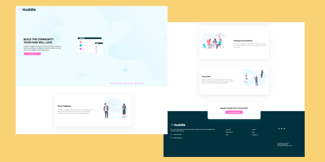
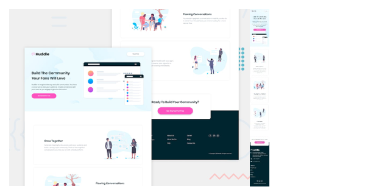

# [Huddle VueJS Landing Page | Frontend Mentor Challenge](https://KathyLambert.me/VueLandingPage)


`Live:` https://KathyLambert.me/VueLandingPage

## Overview

Frontend VueJS Huddle landing page with alternating feature blocks designed by [Frontend Mentor](https://www.frontendmentor.io). Engineered with JavaScript, HTML, and Sass.



### Built With:

- [VueJS](https://vuejs.org)
- [Font Awesome](https://fontawesome.com)

## Getting Started

Clone or download the [repository](https://github.com/CodeMeKathy/VueLandingPage).

### Prerequisites

Either `npm`, `node` are needed to be installed globally on one's machine.

### Installation and Setup Instructions

---

1. Clone or download repository
2. Install project and dependencies by running: `npm install`
3. To start your local server: `npm run serve`
4. Visit local copy of the project, usually running at `localhost:8080`

### Deployment

These instructions will guide one in obtaining a copy of the project on a local machine for development and testing purposes. See deployment for notes on how to deploy the project on a live system.

1. Change GitHub repository GitHuib Pages `Source` settings to `gh-pages branch`

2. Create `deploy.sh` file with the following code:

```
#!/usr/bin/env sh

# abort on errors
set -e

# build
npm run build

# navigate into the build output directory
cd dist

# if you are deploying to a custom domain
# echo 'www.example.com' > CNAME

git init
git add -A
git commit -m 'deploy'

# if you are deploying to https://<USERNAME>.github.io
# git push -f git@github.com:<USERNAME>/<USERNAME>.github.io.git master

# if you are deploying to https://<USERNAME>.github.io/<REPO>
git push -f https://github.com/<USERNAME>/<REPO_NAME>.git master:gh-pages

cd -

```

3. Build with `bash deploy.sh`

4. Visit the Deployed project at the provided link with GitHub pages.

## Features & Code Snippets

- Fully responsive ...
- Uses ...

[ PRETEND SCREEN SHOT IS HERE ][ pretend other screen shot is here ]

### Responsiveness:

---

The website is fully responsive thanks to [Flexbox](https://developer.mozilla.org/en-US/docs/Learn/CSS/CSS_layout/Flexbox).

[](https:// '<Replace Feature>')

### <Replace Feature>:

---

Feature Description ...

[](https:// 'Replace Feature')

#### Closer look:

[](https:// '<Replace Feature>')

### <Replace Feature>:

---

Feature Description ...

[](https:// 'Replace Feature')

## Package Dependencies:

```json
"devDependencies": {
    "@vue/cli-plugin-babel": "^4.1.0",
    "@vue/cli-plugin-eslint": "^4.1.0",
    "@vue/cli-service": "^4.1.0",
    "@vue/eslint-config-prettier": "^5.0.0",
    "babel-eslint": "^10.0.3",
    "eslint-plugin-prettier": "^3.1.1",
    "eslint-plugin-vue": "^6.1.2",
    "node-sass": "^4.13.1",
    "prettier": "^1.19.1",
    "sass-loader": "^8.0.2",
    "vue-template-compiler": "^2.6.10"
  }
```

## Handy Scripts:

```json
  "scripts": {
    "serve": "vue-cli-service serve",
    "build": "vue-cli-service build",

  }
```

## Reflection



- The challenge is to build out the project to the designs specifications.

- The designs are in JPG static format. This means one's own best judgment was used for styles such as `font-size`, `padding` and `margin`. The goal to exercise training one's eye to perceive differences in spacings and sizes.

- A different navigation menu and logo have been implemented to add another aspect to the coding and design challenge.

## License

[MIT](LICENSE) © 2020 CodeMeKathy | Kathy Lambert
